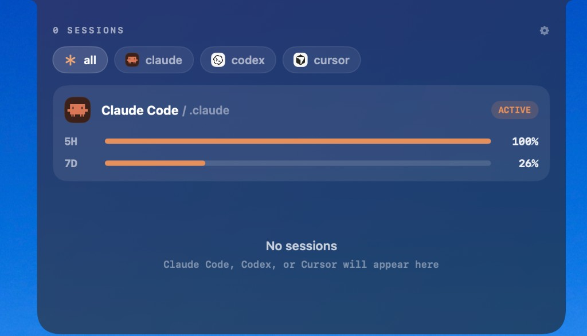

# agentNotch

Live usage limits and sessions for **Claude Code**, **Codex**, and **Cursor** — right in your MacBook notch.

Local-only. No Electron. No cloud. macOS 14+.

<p align="center">
  
</p>

<p align="center">
  <em>Collapsed — ring gauges for every active account, always visible over the notch.</em>
</p>

<p align="center">
  
</p>

<p align="center">
  <em>Expanded — hover to open the panel: account limits, live sessions, and settings.</em>
</p>

---

## What you get

| | |
|---|---|
| **Real limits** | Claude 5H / 7D, Codex API / AUTO, Cursor windows — from local OAuth / session data |
| **Live sessions** | Active Claude, Codex, and Cursor agent sessions appear as they run |
| **Multi-account** | Watch several Claude (or Codex / Cursor) config dirs; switch Claude accounts from the notch |
| **Approvals** | Optional Claude / Cursor hooks so tool prompts bounce the notch for Allow / Deny |
| **Launch at login** | Stay out of the Dock (`LSUIElement`); start with your session from Settings |

Everything stays on your machine. agentNotch only reads local config dirs and (for Claude limits) your existing OAuth token.

---

## Requirements

- **macOS 14** (Sonoma) or later
- A Mac with a **notch** (or any display — the panel still sits at the top center)
- [Swift toolchain](https://swift.org/download/) / Xcode Command Line Tools (`xcode-select --install`)
- At least one of: Claude Code (`~/.claude`), Codex (`~/.codex`), or Cursor (`~/.cursor`)

---

## Install (recommended)

Build a proper `.app` bundle, then put it in Applications:

```sh
git clone https://github.com/Kumario1/agentNotch.git
cd agentNotch

./scripts/package-app.sh
cp -R dist/agentNotch.app /Applications/
open -a agentNotch
```

On first launch the app:

1. Discovers Claude / Codex / Cursor dirs under your home folder
2. Writes `~/.agentnotch.json`
3. Starts watching those dirs for limits and sessions

Hover the top of the screen (over the notch) to expand. Click the **gear** for Settings.

Enable **Launch at login** in Settings if you want it every session. Prefer running from `/Applications` (not from a DMG). macOS may ask you to allow agentNotch under **System Settings → Privacy & Security → Login Items** — Settings shows that status and can open the pane for you.

Each macOS user has their own home directory and Keychain. Install the `.app` once in `/Applications`, then each user opens it once so their accounts are discovered.

### Quick try (no `.app`)

```sh
git clone https://github.com/Kumario1/agentNotch.git
cd agentNotch
swift run -c release
```

No Dock icon — look at the notch. Quit from Activity Monitor or `killall agentNotch`.

### Ship to other Macs

```sh
# 1. Package
./scripts/package-app.sh

# 2. Sign (+ notarize when credentials are set)
SIGN_IDENTITY="Developer ID Application: Your Name (TEAMID)" \
  ./scripts/sign-and-notarize.sh dist/agentNotch.app

# Optional notarization env:
#   APPLE_ID=you@example.com
#   APPLE_TEAM_ID=XXXXXXXXXX
#   APPLE_APP_PASSWORD=xxxx-xxxx-xxxx-xxxx

# 3. DMG for drag-to-Applications
./scripts/make-dmg.sh
```

Without notarization, other Macs will Gatekeeper-block the app. Ad-hoc local signing only:

```sh
SIGN_IDENTITY='-' ./scripts/sign-and-notarize.sh dist/agentNotch.app
```

---

## Multi-account (Claude)

On first launch, agentNotch auto-discovers:

- `~/.claude` if present
- any other home folder that contains `.credentials.json` or `.claude.json` (e.g. `~/claude-work`)
- `~/.codex` / `~/.cursor` when those dirs exist

Edit the list in Settings or in `~/.agentnotch.json`:

```json
{
  "claude": ["~/.claude", "~/claude-work"],
  "codex": ["~/.codex"],
  "cursor": ["~/.cursor"]
}
```

Each dir is one account (log in once per dir with `CLAUDE_CONFIG_DIR=... claude`). In the expanded panel, browse accounts and **Switch** so the next plain `claude` run uses that account’s OAuth token.

**Caveats:** switching only affects newly started `claude` sessions; running sessions keep their token. macOS may prompt for Keychain access. Multi-account use is subject to Anthropic’s terms of service.

---

## Settings & approvals

Open the gear in the expanded notch:

- Watched config directories (add / remove)
- **Launch at login** (`SMAppService`)
- Claude / Cursor **approval hook** install status

When hooks are enabled, pending tool approvals bounce the notch. Use **Allow**, **Always Allow**, or **Deny** (⌘A / ⌥A / ⌘N while the panel is key).

---

## Develop

```sh
# Run
swift run -c release

# Test
swift test

# Package .app
./scripts/package-app.sh
```

Swift Package Manager layout:

- `Sources/agentNotch/` — AppKit + SwiftUI notch UI, limits, sessions
- `Sources/agentnotch-hook/` — stdin hook bridge for Claude / Cursor approvals
- `Tests/agentNotchTests/` — parsing, windows, hooks, account switcher

---

## Troubleshooting

| Symptom | Fix |
|---|---|
| Nothing at the notch | Confirm the process is running (`pgrep -l agentNotch`). Hover the top-center of the menu bar. |
| Empty limits / “No sessions” | Log into Claude / Codex / Cursor once so `~/.claude`, `~/.codex`, or `~/.cursor` exists, then relaunch. |
| Gatekeeper blocks the `.app` | Sign + notarize, or right-click → Open once, or ad-hoc sign with `SIGN_IDENTITY='-'`. |
| Launch at login doesn’t stick | Open from `/Applications`, enable in Settings, then allow under **Login Items**. |
| Keychain prompt | Allow access so Claude OAuth tokens can be read for live limits. |

---

## Privacy

agentNotch is local-first. It reads config and transcript files on disk and uses your existing Claude OAuth credentials only to fetch usage from Anthropic’s usage endpoint. No analytics, no accounts, no telemetry from this app.

---

## License

See the repository for license terms. Contributions welcome — open an issue or PR on [GitHub](https://github.com/Kumario1/agentNotch).
